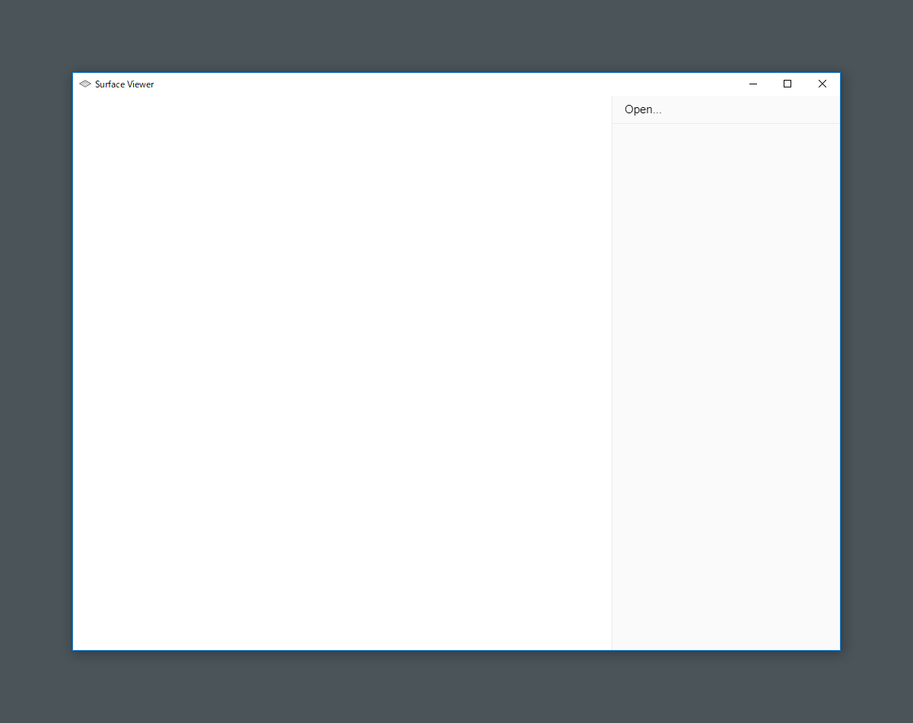
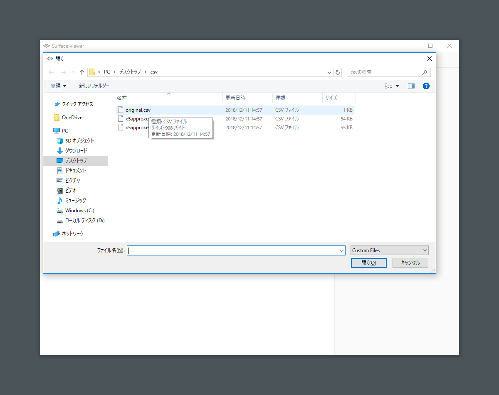
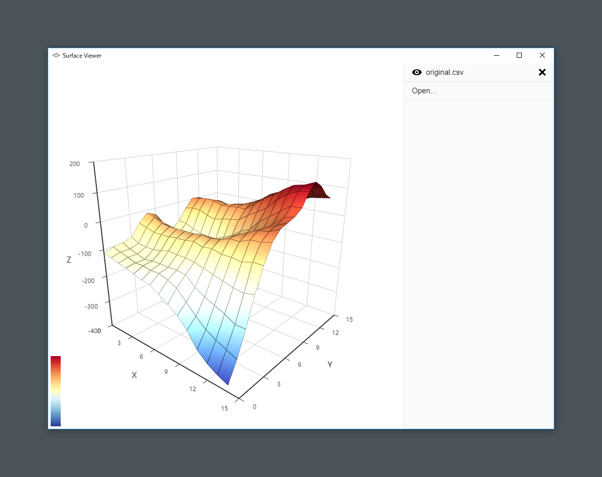
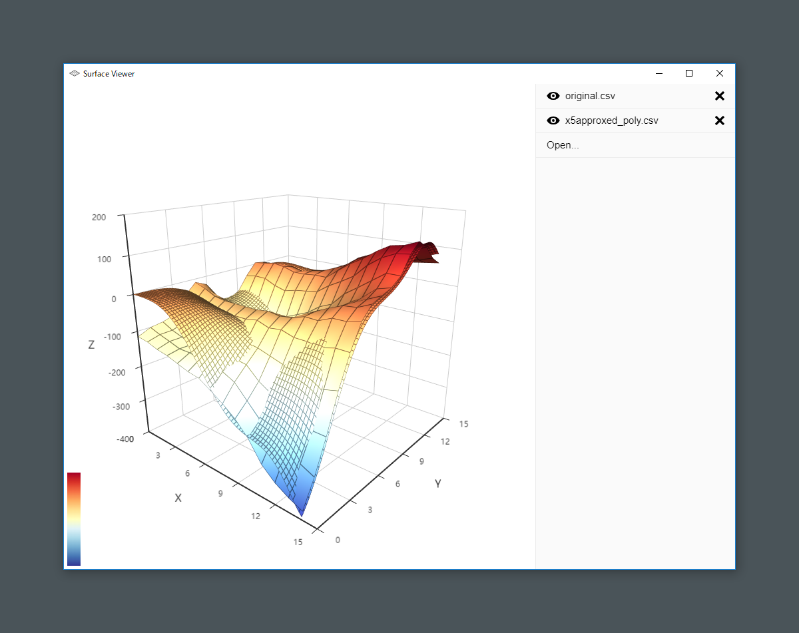
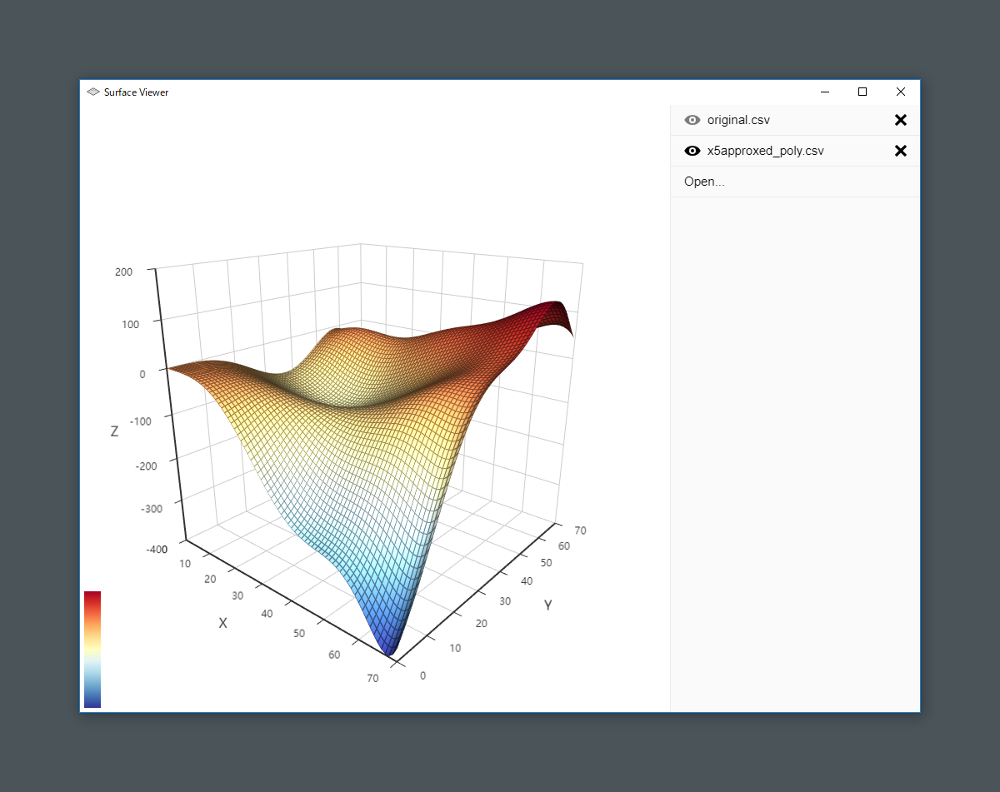

# Surface Viewer の使い方について

Surface Viewer を使用して CSV ファイルを読み込み，3D のグラフとして表示する方法について説明します．

## インストールする

Surface Viewer をインストールするため「Surface Viewer Setup 1.0.0.exe」を実行します．

## アプリケーションを立ち上げる

先ほどのインストールによって，デスクトップに Surface Viewer のショートカットが作成されています．このショートカットから Surface Viewer を起動することができます．

## ファイルを読み込む

Surface Viewer を立ち上げると次のような画面が表示されます．

ここで CSV ファイルを読み込むには，右側の「Open...」をクリックする，または画面内に CSV ファイルをドラッグ & ドロップします．もしアプリケーション側で，ファイル形式などの問題によって正しく読み込むことができなかった場合は，「ファイルの読み込みに失敗しました」とアラートが表示されます．

Surface Viewer では複数の CSV ファイルを読み込み，グラフとして表示させることができます．次の画面のように，複数の CSV ファイルを読み込んだ場合は，データの小さい方を基準として他のデータは縮小されます．

## 特定のファイルを非表示にする

Surface Viewer では，画面の右側に読み込んだファイル名の一覧が表示されるようになっています．このファイル名の一覧，ファイル名の左側にあるアイコンをクリックすると，そのファイル名に対応したグラフのデータを一時的に非表示にすることができます．

## アンインストールする

コントロールパネル上の「プログラムのアンインストール」からアンインストールすることができます．
